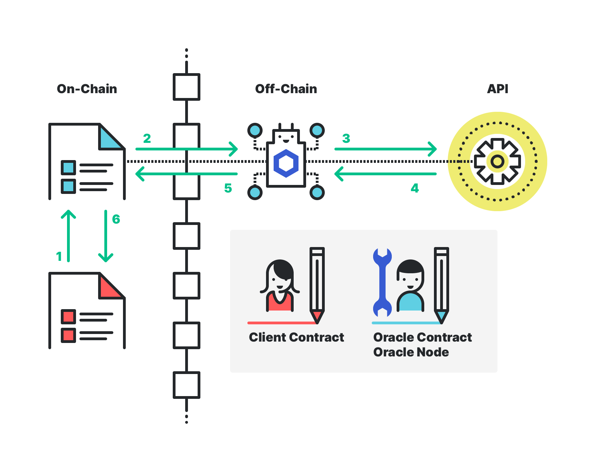

# Integrating NEAR and Chainlink

This repository serves to demonstrate how a smart contract on NEAR can access off-chain data using an incentivized oracle solution with fungible tokens as payments. This repository is in continual development and tracking issues [here](https://github.com/smartcontractkit/near-protocol-contracts/issues).

There are a number of subdirectories in the project that represent the moving pieces of a simple oracle system. 

- Client Contract (The contract that wants a token price from an off-chain API)
- Oracle Contract (An on-chain smart contract that accepts a fungible token payment and stores a request to be processed off-chain)
- Oracle Node (An off-chain machine continuously polling the Oracle Contract on NEAR, and fulfilling requests) 
    - **Note**: code for the Oracle Node is not included in this repository, but one can use an oracle protocol like Chainlink
- Fungible Token (The token paid by the Client Contract to the Oracle Contract in exchange for getting an answer to the Client's request)



## Get NEAR-CLI, Rust, and set up testnet accounts

We'll be using [NEAR CLI](https://docs.near.org/docs/development/near-cli), a command line tool that makes things simpler. Please have [NodeJS version 12 or greater](https://nodejs.org/en/download/package-manager/). Then install globally with:

```bash
npm install -g near-cli
```

These smart contracts are written in Rust. Please follow these directions to get Rust going on your local machine.

Install Rustup:

```bash
curl --proto '=https' --tlsv1.2 -sSf https://sh.rustup.rs | sh
```

([Official documentation](https://www.rust-lang.org/tools/install))

Follow the directions which includes running:

```bash
source $HOME/.cargo/env
```

Add wasm target to your toolchain:

```bash
rustup target add wasm32-unknown-unknown
```

([Info on wasm32-unknown-unknown](https://doc.rust-lang.org/edition-guide/rust-2018/platform-and-target-support/webassembly-support.html))

Rust is now ready on your machine.

Next, create a NEAR testnet account with [Wallet](https://wallet.testnet.near.org).

Set an environment variable to use in these examples. For instance, if your test account is `oracle.testnet` set it like so in your terminal:

```bash
export NEAR_ACCT=oracle.testnet
```

(**Windows users**: please look into using `set` instead of `export`, surrounding the environment variable in `%` instead of beginning with `$`, and using escaped double-quotes `\"` where necessary instead of the single-quotes provided in these instructions.)

Create sub-accounts::

```bash
near create-account oracle.$NEAR_ACCT --masterAccount $NEAR_ACCT
near create-account client.$NEAR_ACCT --masterAccount $NEAR_ACCT
near create-account oracle-node.$NEAR_ACCT --masterAccount $NEAR_ACCT
near create-account near-link.$NEAR_ACCT --masterAccount $NEAR_ACCT
```

We've gone over the different roles earlier, but let's focus on what will happen to get a request fulfilled.

**Client Contract** will call the **Oracle Contract** to make a request for external data.
**Client Contract** gives the **Oracle Contract** an allowance to take NEAR LINK from it. Before officially adding the request, it will `transfer_from` to capture the payment, keeping track of this amount in the `withdrawable_token` state variable.
The **Oracle Node** will be continuously polling the state of its **Oracle Contract** using the paginated `get_requests` function.
The **Oracle Node** will get the API results needed, and send back the answer to the **Oracle Contract**.
The **Oracle Contract** makes a cross-contract call to the callback address (NEAR account) at the callback method provided. It has now fulfilled the request and removes it from state.

## Build, deploy, and initialize

Let's begin!

Build the oracle, client, and NEAR LINK contracts with:

```bash
./build
```

Run all tests:

```bash
./test
```

Then deploy and instantiate like so…

NEAR LINK

```bash
near deploy --accountId near-link.$NEAR_ACCT --wasmFile near-link-token/res/near_link_token.wasm --initFunction new --initArgs '{"owner_id": "near-link.'$NEAR_ACCT'", "total_supply": "1000000"}'
```

Oracle contract

```bash
near deploy --accountId oracle.$NEAR_ACCT --wasmFile oracle/res/oracle.wasm --initFunction new --initArgs '{"link_id": "near-link.'$NEAR_ACCT'", "owner_id": "oracle.'$NEAR_ACCT'"}'
```

Client contract

```bash
near deploy --accountId client.$NEAR_ACCT --wasmFile client/res/client.wasm --initFunction new --initArgs '{"oracle_account": "oracle.'$NEAR_ACCT'"}'
```

## Minor housekeeping

Before the **oracle node** can fulfill the request, they must be authorized. We might as well do this from the get-go.

```bash
near call oracle.$NEAR_ACCT add_authorization '{"node": "oracle-node.'$NEAR_ACCT'"}' --accountId oracle.$NEAR_ACCT
```

(Optional) Check authorization to confirm:

```bash
near view oracle.$NEAR_ACCT is_authorized '{"node": "oracle-node.'$NEAR_ACCT'"}'
```

## Give fungible tokens and set allowances

Give 50 NEAR LINK to client:

```bash
near call near-link.$NEAR_ACCT transfer '{"new_owner_id": "client.'$NEAR_ACCT'", "amount": "50"}' --accountId near-link.$NEAR_ACCT --amount .0365
```

**Note**: above, we use the `amount` flag in order to pay for the state required. (See more about [state staking here](https://docs.near.org/docs/concepts/storage))

(Optional) Check balance to confirm:

```bash
near view near-link.$NEAR_ACCT get_balance '{"owner_id": "client.'$NEAR_ACCT'"}'
```

**client contract** gives **oracle contract** allowance to spend 20 NEAR LINK on their behalf:

```bash
near call near-link.$NEAR_ACCT inc_allowance '{"escrow_account_id": "oracle.'$NEAR_ACCT'", "amount": "20"}' --accountId client.$NEAR_ACCT --amount .0696
```

(Optional) Check allowance to confirm:

```bash
near view near-link.$NEAR_ACCT get_allowance '{"owner_id": "client.'$NEAR_ACCT'", "escrow_account_id": "oracle.'$NEAR_ACCT'"}'
```

## Make a request

Let's make a request to a Chainlink node and request an ETH-USD price:

- Packed JSON arguments: `{"get":"https://min-api.cryptocompare.com/data/price?fsym=ETH&tsyms=USD","path":"USD","times":100}`
- Base64 encoded arguments: `eyJnZXQiOiJodHRwczovL21pbi1hcGkuY3J5cHRvY29tcGFyZS5jb20vZGF0YS9wcmljZT9mc3ltPUVUSCZ0c3ltcz1VU0QiLCJwYXRoIjoiVVNEIiwidGltZXMiOjEwMH0=`

We'll show two ways to have the client contract send the oracle contract a request. First, we'll directly call the oracle contract using the key pair (i.e. keys) from the client contract.

1. **Client contract** makes a direct request to **oracle contract** with payment of 10 NEAR LINK. We can do this because we have the key pair for the client contract.

```bash
near call oracle.$NEAR_ACCT request '{"payment": "10", "spec_id": "dW5pcXVlIHNwZWMgaWQ=", "callback_address": "client.'$NEAR_ACCT'", "callback_method": "token_price_callback", "nonce": "1", "data_version": "1", "data": "eyJnZXQiOiJodHRwczovL21pbi1hcGkuY3J5cHRvY29tcGFyZS5jb20vZGF0YS9wcmljZT9mc3ltPUVUSCZ0c3ltcz1VU0QiLCJwYXRoIjoiVVNEIiwidGltZXMiOjEwMH0="}' --accountId client.$NEAR_ACCT --gas 300000000000000
```

2. **Any NEAR account** calls the **client contract**, providing request arguments. Upon receiving this, the **client contract** sends a cross-contract call to the **oracle contract** to store the request. (Payment and other values are hardcoded here, the nonce is automatically incremented. This assumes that the **client contract** contract only wants to use one oracle contract.)

```bash
near call client.$NEAR_ACCT get_token_price '{"symbol": "eyJnZXQiOiJodHRwczovL21pbi1hcGkuY3J5cHRvY29tcGFyZS5jb20vZGF0YS9wcmljZT9mc3ltPUVUSCZ0c3ltcz1VU0QiLCJwYXRoIjoiVVNEIiwidGltZXMiOjEwMH0=", "spec_id": "dW5pcXVlIHNwZWMgaWQ="}' --accountId client.$NEAR_ACCT --gas 300000000000000
```

## View pending requests

The oracle node is continually polling the state of the **oracle contract** to see the paginated request _summary_. This shows which accounts have requests pending and the total amount of pending requests:

```bash
near view oracle.$NEAR_ACCT get_requests_summary '{"max_num_accounts": "10"}'
```

**Note**: aside from `get_requests_summary` there is also `get_requests_summary_from`. Since the [`TreeMap` data structure](https://docs.rs/near-sdk/1.0.0/near_sdk/collections/struct.TreeMap.html) is ordered, the former will list the first N (`max_num_accounts`). Usage of `get_requests_summary_from` is for paging, providing a window of results to return. Please see function details for parameters and usage.

For folks who prefer to see a more low-level approach to hitting the RPC, here's the [curl](https://en.wikipedia.org/wiki/CURL) command performing the same query:

```bash
curl -d '{"jsonrpc": "2.0", "method": "query", "id": "chainlink", "params": {"request_type": "call_function", "finality": "final", "account_id": "oracle.'$NEAR_ACCT'", "method_name": "get_requests_summary", "args_base64": "eyJtYXhfbnVtX2FjY291bnRzIjogIjEwIn0="}}' -H 'Content-Type: application/json' https://rpc.testnet.near.org
```

The above will return something like:

```json
{
  "jsonrpc": "2.0",
  "result": {
    "result": [
      91,
      123,
      34,
      97,
      99,
      99,
      111,
      117,
      110,
      116,
      34,
      58,
      34,
      99,
      108,
      105,
      101,
      110,
      116,
      46,
      100,
      101,
      109,
      111,
      46,
      116,
      101,
      115,
      116,
      110,
      101,
      116,
      34,
      44,
      34,
      116,
      111,
      116,
      97,
      108,
      95,
      114,
      101,
      113,
      117,
      101,
      115,
      116,
      115,
      34,
      58,
      49,
      125,
      93
    ],
    "logs": [],
    "block_height": 10551293,
    "block_hash": "Ljh67tYk5bGXPu9TamJNG4vHp18cEBDxebKHpEUeZEo"
  },
  "id": "chainlink"
}
```

We'll outline a quick way to see the results if the machine has [Python installed](https://docs.python-guide.org/starting/install3/osx/). Copy the value of the innermost `result` key, which is an array of unsigned 8-bit integers.

Open the Python REPL with the command `python` and see the prompt with `>>>`.

Enter the below replacing BYTE_ARRAY with the the innermost result value (including the square brackets):

```python
res = BYTE_ARRAY
```

then:

```python
''.join(chr(x) for x in res)
```

and python will print something like:

```text
'[{"account":"client.demo.testnet","total_requests":1}]'
```

The previous command (calling the method `get_requests_summary`) is useful if there has been significant scaling from many client accounts/contracts. To see the individual requests for a particular user, use the following command:

```bash
near view oracle.$NEAR_ACCT get_requests '{"account": "client.'$NEAR_ACCT'", "max_requests": "10"}'
```

The **oracle node** uses the passed request arguments to fetch the price of (for example) Basic Attention Token (BAT) and finds it is at \$0.19 per token.
The data `0.19` as a `Vec<u8>` is `MTkuMQ==`

There's a third method to get all the requests, ordered by account name and nonce, where a specified maximum number of results is provided.

```bash
near view oracle.$NEAR_ACCT get_all_requests '{"max_num_accounts": "100", "max_requests": "100"}'
```

## Fulfill the request

**Oracle Node** uses its NEAR account keys to fulfill the request:

```bash
near call oracle.$NEAR_ACCT fulfill_request '{"account": "client.'$NEAR_ACCT'", "nonce": "0", "data": "MTkuMQ=="}' --accountId oracle-node.$NEAR_ACCT --gas 300000000000000
```

(Optional) Check the **client contract** for the values it has saved:

```bash
near view client.$NEAR_ACCT get_received_vals '{"max": "100"}'
```

## Check final balance/allowance

(Optional) Check the balance of **client contract**:

```bash
near view near-link.$NEAR_ACCT get_balance '{"owner_id": "client.'$NEAR_ACCT'"}'
```

Expect `40`

(Optional) Check the allowance of **oracle contract**:

```bash
near view near-link.$NEAR_ACCT get_allowance '{"owner_id": "client.'$NEAR_ACCT'", "escrow_account_id": "oracle.'$NEAR_ACCT'"}'
```

Expect `10`

The oracle node and oracle contract are assumed to be owned by the same person/entity. The oracle contract has "withdrawable tokens" that can be taken when it's most convenient. Some oracles may choose to transfer these tokens immediately after fulfillment. Here we are using the withdrawable pattern, where gas is conserved by not transferring after each request fulfillment.

Also, when the feature of cancelling requests is implemented, the withdrawable tokens is used to ensure the correct amount of fungible tokens can be withdrawn without interfering with possible cancellations within a given period.

## Withdraw tokens

(Optional) Check the withdrawable tokens on the oracle contract with this command:

```bash
near view oracle.$NEAR_ACCT get_withdrawable_tokens
```

(Optional) Check the fungible token balance of the client and the base account we'll be extracting to it. (This is the original account we set the `NEAR_ACCT` environment variable to, for demonstration purposes)

```bash
near view near-link.$NEAR_ACCT get_balance '{"owner_id": "oracle.'$NEAR_ACCT'"}'
near view near-link.$NEAR_ACCT get_balance '{"owner_id": "'$NEAR_ACCT'"}'
```

Finally, withdraw the fungible tokens from the oracle contract into the oracle node, the base account, who presumably owns both the oracle node and oracle contract.

```bash
near call oracle.$NEAR_ACCT withdraw '{"recipient": "oracle-node.'$NEAR_ACCT'", "amount": "10"}' --accountId oracle.$NEAR_ACCT --gas 300000000000000
```

You may use the previous two `get_balance` view methods to confirm that the fungible tokens have indeed been withdrawn.

## Notes

The client is responsible for making sure there is enough allowance for fungible token transfers. It may be advised to add a cushion in addition to expected fungible token transfers as duplicate requests will also decrease allowance.

**Scenario**: a client accidentally sends the same request or a request with the same nonce. The fungible token transfer occurs, decrementing the allowance on the fungible token contract. Then it is found that it's a duplicate, and the fungible tokens are returned. In this case, the allowance will not be increased as this can only be done by the client itself.

One way to handle this is for the client to have logic to increase the allowance if it receives the response indicating a duplicate request has been sent. Another way might be to increase the allowance before each request. Again, this decision is up to the owner of the client contract.

## Outstanding work

There are various issues opened in this repository. As mentioned early in this document, this is an ever-growing repository. Soon we'll implement using the expiration to allow the client contract to cancel their request and receive the tokens back if it's within the window. There's also work in terms of setting up the [PreCoordinator](https://github.com/smartcontractkit/chainlink/blob/develop/evm-contracts/src/v0.5/PreCoordinator.sol) and whatnot.

Contributors are welcome to get involved!
